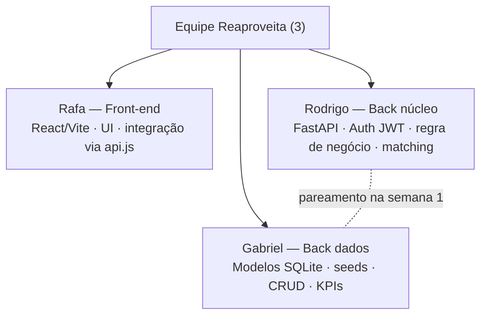
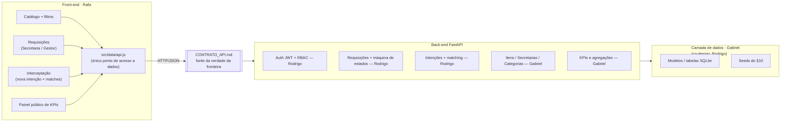
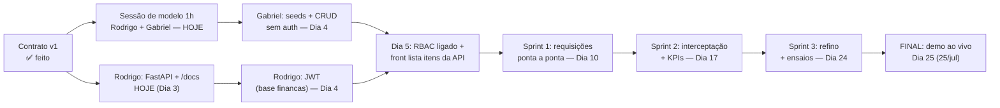

# Organograma de Desenvolvimento — Reaproveita

**Versão 1.1 — 03/07/2026 (Dia 3)** · Complementa `CONTRATO_API.md` e `PLANEJAMENTO.md` (v2).
Define **quem é dono de quê**, o estado atual e as dependências. Divisão ajustada aos perfis reais da equipe.

---

## 1. Equipe e responsabilidades

**Por que essa divisão:**
- **Rodrigo** já entregou back-end com Python + Flask + MySQL + **JWT** no projeto financas e foi Database Administrator. Fica com o risco técnico: auth (porta o padrão do financas para FastAPI), máquina de estados com `quantidade_reservada` (§5 do contrato) e matching (§4). Pela experiência com banco, ele também **co-desenha o modelo de dados** com Gabriel numa sessão de ~1h — Gabriel implementa.
- **Gabriel** está estudando análise de dados — tabelas, seeds, CRUD simples e as agregações dos KPIs (§7) são o território certo, com raio de dano menor. **Regra: na semana 1, Gabriel não fica sozinho em nada que bloqueie checkpoint** (edital 8.4: checkpoint perdido = eliminação).
- **Rafa** segue no front (que já existe) e é o guardião do `CONTRATO_API.md`.

## 2. Mapa de módulos e donos

Regra de fronteira: **ninguém altera formato de request/response direto no código.** Mudou algo → edita o `CONTRATO_API.md` primeiro → avisa no grupo → aí implementa.

## 3. Estado atual (Dia 3 — 03/jul)

| Item | Dono | Status |
|---|---|---|
| Inscrição oficial da equipe (edital 6.3) | Equipe | ✅ Feita |
| Desafio travado: Almoxarifado / Reaproveita | Equipe | ✅ |
| Protótipo front completo (mock, build limpo) | Rafa | ✅ |
| Camada `api.js` com marcadores `// TODO: API` | Rafa | ✅ |
| `CONTRATO_API.md` v1.0 | Rafa | ✅ — **validação de Rodrigo (§4, §5) e Gabriel (§10) é a 1ª tarefa de hoje** |
| `PLANEJAMENTO.md` v2 (nomes + datas reais) | Equipe | ✅ Atualizado hoje |
| Projeto FastAPI + `/health` + `/docs` | Rodrigo | ⬜ **Hoje (Dia 3)** |
| Sessão de modelo de dados (~1h, juntos) | Rodrigo + Gabriel | ⬜ **Hoje (Dia 3)** |
| Modelos + seeds (§10) | Gabriel | ⬜ Dia 4 |
| CRUD leitura (secretarias, categorias, itens) **sem auth** | Gabriel | ⬜ Dia 4 |
| Auth JWT (padrão do financas → FastAPI) | Rodrigo | ⬜ Dia 4 |
| RBAC ligado nos endpoints + `POST /itens` | Rodrigo + Gabriel | ⬜ Dia 5 |
| Front plugado (começa por `getItens()`) | Rafa | ⬜ Dia 5 |
| Requisições + transições (§5) | Rodrigo | ⬜ Sprint 1 |
| Intenções + matching (§4) | Rodrigo | ⬜ Sprint 2 |
| KPIs (§7) | Gabriel | ⬜ Sprint 2 |

> O back está 2 dias atrás do plano original. É recuperável **porque auth não bloqueia o CRUD**: as trilhas do Rodrigo e do Gabriel correm em paralelo e se encontram no Dia 5.

## 4. Dependências e marcos

| Marco | Data | Critério de pronto |
|---|---|---|
| **Base recuperada** | 05/jul (Dia 5) | `/docs` cobre §2–§3 · seeds no banco · front listando itens vindos da API real |
| Fim da Sprint 1 | 10/jul (Dia 10) | Fluxo requisitar → aprovar → transferir completo e persistido |
| Fim da Sprint 2 | 17/jul (Dia 17) | Interceptação ponta a ponta · KPIs ao vivo · painel público |
| Fim da Sprint 3 | 24/jul (Dia 24) | 3 ensaios feitos · pitch deck · repositório organizado (edital 11) |
| **Final** | 25/jul (Dia 25) | Pitch 4 min + PoC ao vivo — a demonstração é o essencial (edital 13.2) |

Marcos internos fecham sempre **1 dia antes** do checkpoint oficial da semana (edital 8.4). Detalhe de tarefas: `PLANEJAMENTO.md`.

## 5. Regras de trabalho

1. **Fluxo git:** branch por módulo (`feat/auth`, `feat/matching`, `feat/seeds`) → PR → merge na `main`. Revisor do PR = dono do módulo vizinho (quem consome a interface).
2. **Pareamento:** semana 1, Gabriel programa junto com Rodrigo nas tarefas de dados (call ou presencial). Destravar rápido > dividir para conquistar cedo demais.
3. **Sincronização:** 1 mensagem diária no grupo por pessoa — fiz / farei / me bloqueia. Bloqueio sem resposta em 2h → chamar os outros dois.
4. **Contrato primeiro:** qualquer mudança de campo, rota ou regra passa pelo `CONTRATO_API.md` antes do código.
5. **Demo sempre viva:** a `main` roda a qualquer momento — é ela que aparece nos checkpoints eliminatórios.
6. **Escopo congelado:** MVP = o que está no contrato; ideia nova vai para o §9 (roadmap do pitch). Lição do financas: backlog aberto demais e sem marco fechado = projeto parado no meio.
